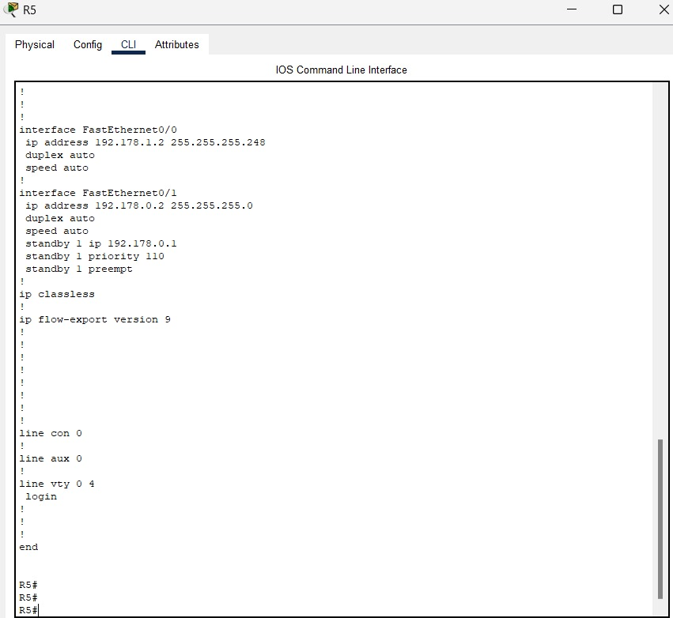

## Manual practica 2

## Topologia completa


## Comandos utilizados
```cmd
enable
conf t
standby 1 ip 192.168.1.1
standby 1 priority 110
standby 1 preempt
```

standby 1 ip 192.168.1.1: Este comando se utiliza en la configuración de HSRP (Hot Standby Router Protocol). Con este comando, estás configurando la dirección IP virtual para el grupo de HSRP número 1 como 192.168.1.1. Esta será la dirección IP que se utilizará como la puerta de enlace predeterminada para los dispositivos en la red si el router activo falla.

standby 1 priority 110: Este comando se utiliza en la configuración de HSRP para establecer la prioridad del router en el grupo de HSRP número 1. Cuanto mayor sea la prioridad, más probabilidades habrá de que el router sea elegido como el router activo en caso de un fallo. En este caso, la prioridad se establece en 110.

standby 1 preempt: Este comando se utiliza en la configuración de HSRP para habilitar la función de preemption. Esto significa que si un router con una prioridad más alta se vuelve disponible nuevamente después de estar inactivo, tomará la función de router activo, incluso si otro router con una prioridad más baja está actualmente activo.

```cmd
int s0/0
ip address 10.1.1.2 255.255.255.252
no shut
```

int s0/0: Este comando se utiliza para ingresar al modo de configuración de la interfaz serial 0/0. La abreviatura "int" es comúnmente utilizada para "interface".

ip address 10.1.1.2 255.255.255.252: Este comando asigna una dirección IP a la interfaz serial 0/0. En este caso, la dirección IP asignada es 10.1.1.2 con una máscara de subred de 255.255.255.252. Esto significa que la interfaz forma parte de la red 10.1.1.0 y solo hay dos direcciones disponibles para hosts en esta subred (10.1.1.1 y 10.1.1.2), ya que las direcciones de red y de broadcast están reservadas.

no shut: Este comando se utiliza para activar la interfaz serial 0/0. Si la interfaz está en estado de "shutdown" (apagada), este comando la activará para que pueda enviar y recibir tráfico de red. Si la interfaz ya está activada, este comando no tendrá efecto.


#### Configuracion R1


#### Configuracion R2


#### Configuracion R5


#### Configuracion Switch 1


#### Configuracion Standby
